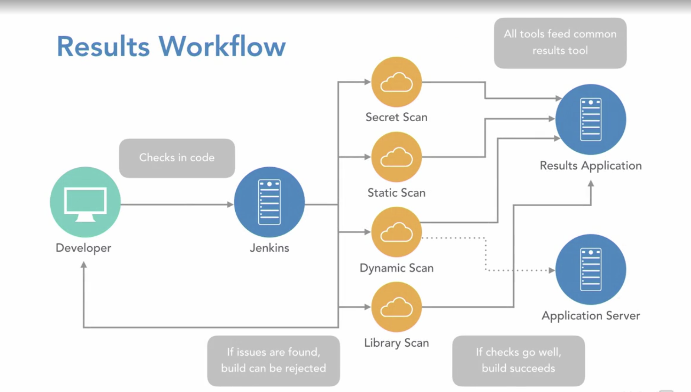
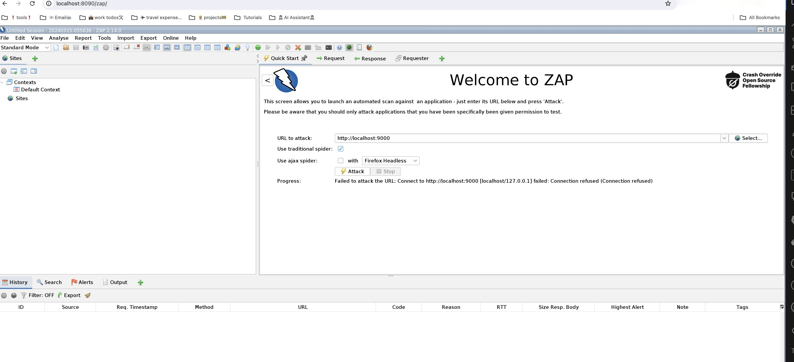
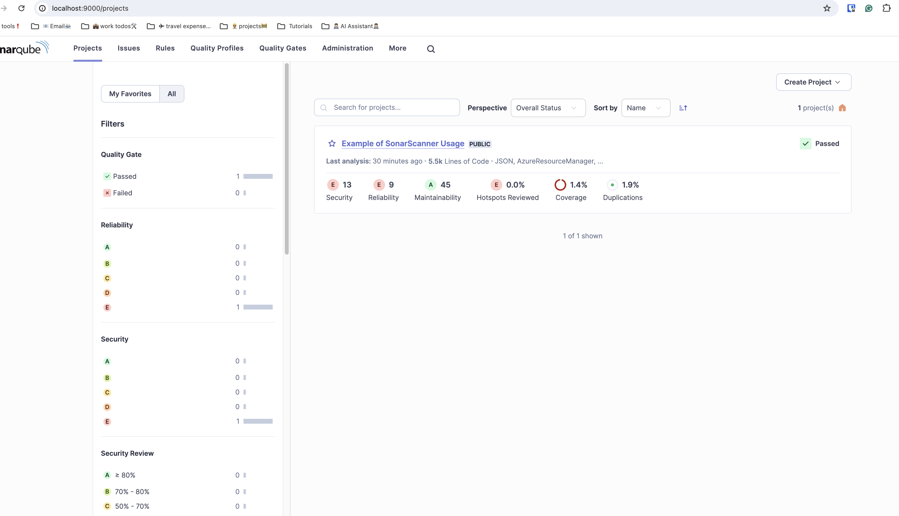
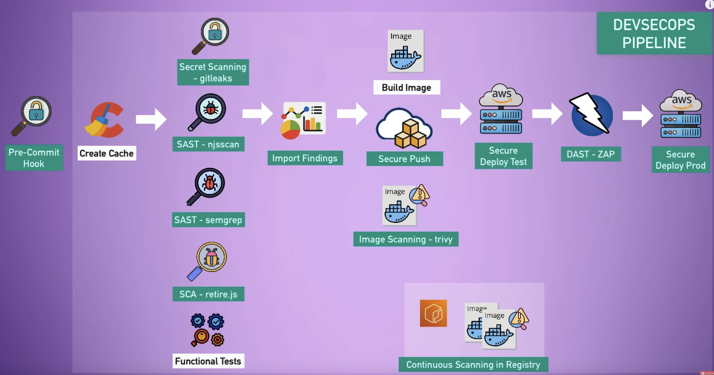

# Application Security in DevSecOps



To get started let us get working container:

```bash
cat << 'EOF' > entrypoint.sh
#!/bin/sh
chown -R 1000:1000 .
inotifyd /:/:ce |
while read -r directory events filename; do
  chown 1000:1000 "$directory/$filename"
done &
exec "$@"
EOF
chmod +x entrypoint.sh

# Run a working container
docker run -it --rm --net host --name working-container \
-v /var/run/docker.sock:/var/run/docker.sock \
-v ${PWD}:/work \
-v ./entrypoint.sh:/root/entrypoint.sh \
--entrypoint /root/entrypoint.sh \
-w /work alpine sh

```

```bash
mkdir -p /cmd
```

Install common utilities

```bash
# Install common utilities and beautify the terminal
apk update
apk add --no-cache docker curl wget python3 py3-pip python3-dev libffi-dev openssl-dev gcc libc-dev make  zip bash openssl git mongodb-tools openssl git docker-compose zsh vim nano bash unzip npm openjdk17
# Install zsh for a cool looking terminal with plugins auto-suggestions and syntax-highlighting
sh -c "$(curl -fsSL https://raw.github.com/robbyrussell/oh-my-zsh/master/tools/install.sh)"

## Clone the zsh-autosuggestions repository into $ZSH_CUSTOM/plugins
git clone https://github.com/zsh-users/zsh-autosuggestions.git $ZSH_CUSTOM/plugins/zsh-autosuggestions
git clone https://github.com/zsh-users/zsh-syntax-highlighting.git $ZSH_CUSTOM/plugins/zsh-syntax-highlighting
sed -i.bak 's/plugins=(git)/plugins=(git zsh-autosuggestions zsh-syntax-highlighting)/' ~/.zshrc
```

Deleting in linux is a dangerous operation, let us create a script to confirm before deleting

```bash
cat << 'EOF' > /cmd/confirm_rm_rf.sh
#!/bin/sh
printf "Do you really wanna delete (yes/no) \n===>: "
# Reading the input from terminal
read answer
if [ $answer == "yes" ]
then
  rm -rf $@
elif [ "$answer" !=  "yes" ]
then
  printf "You didn't confirm!\nExiting, no action taken!"
fi
EOF
chmod +x /cmd/confirm_rm_rf.sh
cat /cmd/confirm_rm_rf.sh


# ---
cat << 'EOF' >> ~/.zshrc
source $ZSH/oh-my-zsh.sh
source $ZSH_CUSTOM/plugins/zsh-autosuggestions
source $ZSH_CUSTOM/plugins/zsh-syntax-highlighting
export PATH="$PATH:/cmd"
alias rm="confirm_rm_rf.sh"
export JAVA_HOME=/usr/lib/jvm/java-17-openjdk
EOF
cat ~/.zshrc

# To apply the changes, the auto-suggestions and syntax-highlighting plugins must be sourced:
source ~/.zshrc
zsh
```

Install the DevSecOps tools

```bash
# Install DevSecOps tools
docker run -d --name sonarqube -p 9000:9000 sonarqube

# Install sonarscanner
./install-sonar-scanner.sh
sonar-scanner -v

# Install OWASP ZAP
docker run -d --name zap2docker-stable -u zap -p 8090:8080 -i owasp/zap2docker-stable zap-webswing.sh
# Navigate to http://localhost:8090/zap/

# You can also run using the following command with docker:
mkdir -p demo-zap
docker run --user root --name weekly  -v zap:/zap/wrk/:rw -t owasp/zap2docker-weekly zap-baseline.py -t http://testphp.vulnweb.com/ -r cli-zap-report-testphp.html
```



```sh
# Install Contrast Security externally on the host (macOS)
brew tap contrastsecurity/tap
brew install contrast

# Install webgoat for IAST testing which an interactive application security testing tool
docker run  --name webgoat -d -p 8090:8080 -t webgoat/webgoat-8.0
```

To get started with SonarQube, open a browser and navigate to `http://localhost:9000`. The default username and password is `admin` and `admin`.

You also need to donwload sonar scanner example from [here](https://github.com/SonarSource/sonar-scanning-examples.git) and run the following command:

```bash
git clone https://github.com/SonarSource/sonar-scanning-examples.git
cd sonar-scanning-examples/sonarqube-scanner

# Generate a token from SonarQube and replace the token below
# Click on acccount -> My Account -> Security -> Generate Token and replace the token below
sonar-scanner -Dsonar.login=user-token

# Open the browser and navigate to http://localhost:9000
```



---

DevSecOps is a set of practices that combines software development and IT operations with security practices. The main goal of DevSecOps is to shorten the development lifecycle and provide continuous delivery with high software quality. DevSecOps aims to integrate security at every phase of the software development lifecycle, from planning to coding, testing, and deployment.



We are going to use `pygoat` project to demonstrate how to integrate security into the DevOps pipeline. The `pygoat` project is a deliberately insecure web application that allows security enthusiasts to test their security skills. The project is written in Python and uses the Flask web framework.

Instructions can be found in the [README.md](./README-pygoat.md) file.

---

We are using github actions to automate the DevSecOps pipeline. The pipeline is defined in the `.github/workflows` directory. The pipeline is defined in the `main.yml` file.

We setup `bandit` and it can scan the code for vulnerabilities. Even when the earlier steps fail, the bandit report will be generated.

Now let us `docker scout` to scan the docker image for vulnerabilities in github actions pipeline.
